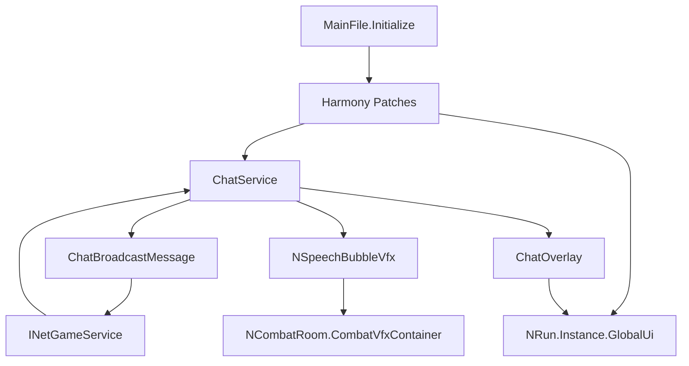

# 变更提案: coop-chat-overlay

## 元信息
```yaml
类型: 新功能
方案类型: implementation
优先级: P1
状态: 草稿
创建: 2026-03-08
```

---

## 1. 需求

### 背景
《Slay the Spire 2》当前没有直接的多人打字交流入口。目标是在联机对局里补一个轻量聊天 Mod，既能提供基础的文字沟通，又尽量复用游戏现有的联机消息和战斗内说话气泡表现，避免另起一套完全割裂的 UI 与视觉逻辑。项目将参考 `E:/sts2-borrow` 的 Godot + C# + Harmony + 官方 Modding API 组织方式，在空仓 `E:/sts2-speak` 中落地一个新的聊天 Mod。

### 目标
实现一个局内可用的联机聊天系统：玩家按 `Tab` 显示/隐藏聊天框；聊天框分为上方聊天记录区和下方输入框；其他玩家发言时只显示聊天记录预览，不显示输入框；预览保持失焦 5 秒后开始在 4 秒内逐渐透明直至隐藏；渐隐期间按 `Tab` 要立即取消渐隐并恢复原有的 `Tab` 显隐逻辑；若当前处于战斗且能拿到对应玩家 `Creature`，则尽量复用 `NSpeechBubbleVfx.Create(text, player.Creature, seconds)` 让聊天文字同时显示在角色头顶气泡上。

### 约束条件
```yaml
时间约束: 第一版优先完成联机聊天主链路与稳定的 UI 状态机，不扩展频道、私聊、表情或聊天记录持久化。
性能约束: 远端消息到达后应能即时刷新聊天记录与预览，不得因 Tween、定时器或重复创建节点造成明显卡顿。
兼容性约束: 沿用 `E:/sts2-borrow` 的工程组织方式，使用 Godot UI、Harmony、`INetGameService`、`NRun.Instance.GlobalUi`、`NHotkeyManager` 与游戏内现有 VFX 能力，不额外引入重型第三方框架。
业务约束: 聊天仅在真实多人联机局内生效；消息需做空字符串拦截、长度限制与幂等去重；头顶气泡属于“可用时复用”，若非战斗或缺少 `Creature` 则只保证聊天框展示。
```

### 验收标准
- [ ] 玩家在联机局内按 `Tab` 可切换聊天框显示与隐藏；完整输入态下可看到上方聊天记录与下方输入框，再次按 `Tab` 后聊天框隐藏。
- [ ] 本地发送消息后，所有联机玩家都能收到同一条聊天内容，并在聊天记录区看到“玩家名 + 文本”的展示结果，发送者本地不会因广播回环而重复插入记录。
- [ ] 远端玩家发言时，若当前不是输入态，则只显示聊天记录预览，不显示输入框，并在 5 秒后开始 4 秒渐隐直至隐藏；渐隐或倒计时期间按 `Tab` 会立即取消该过程并切换到原有显隐逻辑。
- [ ] 在战斗场景下，若能定位到发言玩家对应的 `Creature` 和 `NCombatRoom.Instance.CombatVfxContainer`，则聊天文本会额外以头顶说话气泡方式显示；若上下文不可用，则不会报错且聊天记录仍正常显示。
- [ ] 工程可完成基础构建验证，并补齐 README 与知识库文档，说明功能边界、已知限制和建议的多人手工验证步骤。

---

## 2. 方案

### 技术方案
本功能采用“服务主导 + UI 状态机”的实现：`ChatService` 作为唯一业务中枢，负责联机消息注册、消息广播、幂等去重、聊天历史缓存、远端消息驱动的预览态展示，以及战斗内头顶气泡的复用；`ChatOverlay` 作为挂载到 `NRun.Instance.GlobalUi` 的常驻 UI 外壳，专注于渲染聊天记录、输入框和 `Hidden | Preview | Compose | Fading` 四种显示状态，并将 `Tab`、发送、隐藏、取消渐隐等交互转发给服务层。生命周期继续沿用参考仓模式：`MainFile` 初始化 Harmony，`Patches/GameBootstrapPatch.cs` 在 `NGame._Ready` / `NRun._Ready` / `RunManager.CleanUp` 中完成全局初始化、当前对局挂载和清理。联机同步使用 `INetGameService.RegisterMessageHandler` + `SendMessage` 广播 `ChatBroadcastMessage`；头顶气泡不硬 patch 游戏内部 ping 私有逻辑，而是直接复用同一底层能力 `NSpeechBubbleVfx.Create(text, player.Creature, seconds)` 与 `NCombatRoom.Instance?.CombatVfxContainer.AddChildSafely(...)`，以获得与原生说话气泡一致的视觉表现。

### 影响范围
```yaml
涉及模块:
  - Mod bootstrap: 建立 `Sts2Speak` 工程骨架、Mod 入口、Manifest 与 Godot 配置。
  - Runtime patches: 通过 Harmony 把聊天服务挂到游戏与对局生命周期。
  - Network messaging: 定义聊天广播消息结构、序列化和消息处理器。
  - Chat service: 管理聊天历史、发送接收、消息去重、气泡复用与 UI 协调。
  - Chat UI: 构建聊天框、输入框、状态机、5 秒停留与 4 秒渐隐逻辑。
  - Documentation: 更新 README 与 `.helloagents` 知识库，记录模块职责、边界与验证建议。
预计变更文件: 13
```

### 风险评估
| 风险 | 等级 | 应对 |
|------|------|------|
| `Tab` 被 Godot 焦点导航或游戏原本输入优先消费，导致显隐逻辑不稳定 | 高 | 在 `ChatOverlay` 根节点统一捕获 `InputEventKey`，优先处理 `Tab`，并在需要时标记输入已处理。 |
| 广播消息在发送端回环导致本地重复显示聊天记录 | 高 | 为每条消息引入 `MessageId`，维护已处理集合，发送成功后和接收时都按 ID 去重。 |
| 渐隐 Tween 与新消息/Tab 切换发生竞态，导致聊天框卡在半透明状态 | 中 | 抽出统一的 `CancelTransientVisibility()` / `ResetPreviewFade()`，在任何切状态前强制 kill 旧 timer/tween 并恢复 alpha。 |
| 远端玩家在非战斗或特殊时机没有可用 `Creature`，导致头顶气泡无法显示 | 中 | 将气泡逻辑作为 best effort；无法显示时仅更新聊天记录，不中断主流程。 |
| 新仓从零初始化时遗漏参考仓的必要工程配置，导致无法构建或无法被游戏识别 | 中 | 直接参考 `E:/sts2-borrow` 的 `.csproj`、`project.godot`、`mod_manifest.json`、`MainFile.cs` 与目录布局进行最小改造。 |

---

## 3. 技术设计（可选）

> 本功能不引入 HTTP API，但会新增联机消息协议、UI 状态机与战斗气泡复用链路。

### 架构设计


### 联机消息设计
#### `ChatBroadcastMessage`
- **用途**: 在联机玩家之间广播一条聊天消息
- **字段**:
  - `MessageId: string`
  - `SenderId: ulong`
  - `Text: string`
- **特性**:
  - `ShouldBroadcast = true`
  - `Mode = NetTransferMode.Reliable`
  - 采用 `IPacketSerializable` 进行字符串与发送者 ID 序列化

### 运行时状态模型
| 状态 | 说明 | 输入框 | 自动隐藏 | 触发来源 |
|------|------|--------|----------|----------|
| Hidden | 完全隐藏 | 否 | 否 | 默认/手动关闭 |
| Preview | 仅显示聊天记录 | 否 | 5 秒后进入渐隐 | 远端消息到达 |
| Compose | 显示聊天记录 + 输入框 | 是 | 否 | 玩家按 `Tab` 打开 |
| Fading | 仅显示聊天记录并执行 4 秒渐隐 | 否 | 结束后隐藏 | Preview 超时 |

### 关键行为流程
#### 场景: 本地玩家按 `Tab`
**模块**: `Ui/ChatOverlay.cs`
**条件**: 当前在运行中的多人联机局
**行为**: 捕获 `Tab` → 若处于 `Preview/Fading` 先取消倒计时和渐隐 → `Hidden/Preview/Fading -> Compose`，`Compose -> Hidden`
**结果**: 聊天框以用户预期显隐，并保证不会保留残留渐隐状态

#### 场景: 本地发送消息
**模块**: `Services/ChatService.cs`
**条件**: 输入框存在合法文本，当前联机服务可用
**行为**: 构造 `ChatBroadcastMessage` → 发送广播 → 本地历史追加 → 刷新 UI → 战斗中尝试显示本地玩家头顶气泡
**结果**: 发送者立即看到消息，远端随后同步看到相同内容

#### 场景: 远端收到消息
**模块**: `Services/ChatService.cs` + `Ui/ChatOverlay.cs`
**条件**: 收到合法、未处理过的聊天消息
**行为**: 校验发送者 → 追加历史 → 若当前不是 `Compose` 则切到 `Preview` → 重置 5 秒计时 → 战斗中尝试显示远端玩家头顶气泡
**结果**: 远端消息被即时展示，用户未主动打开输入态时只看到聊天记录预览

#### 场景: Preview 自动淡出
**模块**: `Ui/ChatOverlay.cs`
**条件**: `Preview` 状态下 5 秒内无新的消息或 `Tab` 切换
**行为**: 启动 4 秒 alpha tween，期间如收到消息或按 `Tab` 则取消 tween 并恢复正常状态机
**结果**: 聊天记录提示会自动逐步消失，不长期遮挡画面

---

## 4. 核心场景

> 执行完成后同步到对应模块文档

### 场景: 通过 Tab 主动打开聊天输入
**模块**: `chat_overlay`
**条件**: 当前在多人联机局，聊天覆盖层已挂载
**行为**: 玩家按 `Tab`，聊天框从隐藏或预览态切到完整输入态，显示历史区和输入框，并获取焦点
**结果**: 玩家可以直接输入并发送文字消息

### 场景: 队友发言触发记录预览
**模块**: `chat_overlay`
**条件**: 当前不是输入态，收到一条有效的远端消息
**行为**: 只显示聊天记录区，不显示输入框，同时开始预览停留计时
**结果**: 玩家能看到队友发言，但不会被强制拉起输入框

### 场景: 战斗内复用头顶说话气泡
**模块**: `chat_service`
**条件**: 消息发送者在战斗中且具备可用 `Creature`
**行为**: 调用 `NSpeechBubbleVfx.Create(text, player.Creature, seconds)`，把聊天文本加入战斗特效容器
**结果**: 该玩家头顶出现与原生说话气泡风格一致的聊天气泡

### 场景: 渐隐中按 Tab 取消自动隐藏
**模块**: `chat_overlay`
**条件**: 当前处于 `Fading`
**行为**: 玩家按 `Tab` 时立即停止 tween、恢复 alpha、清除淡出计时，再按状态机切到完整输入态
**结果**: 用户操作优先级高于自动隐藏逻辑，不会出现“刚按 Tab 但 UI 仍继续消失”的体验问题

---

## 5. 技术决策

> 本方案涉及的技术决策，归档后成为决策的唯一完整记录

### coop-chat-overlay#D001: 采用“服务主导 + UI 状态机”而不是“纯 UI 控制器主导”
**日期**: 2026-03-08
**状态**: ✅采纳
**背景**: 该功能同时涉及联机消息同步、聊天历史缓存、状态机 UI、自动淡出和战斗气泡复用，需要决定由服务层还是 UI 控制器承担主要协调职责。
**选项分析**:
| 选项 | 优点 | 缺点 |
|------|------|------|
| A: `ChatService` 负责消息、历史、气泡与状态协调，`ChatOverlay` 负责显示与输入 | 更贴近 `E:/sts2-borrow` 的结构，网络与业务入口集中，后续扩展频道/系统消息更稳 | 服务层职责会偏大，需要控制文件复杂度 |
| B: `ChatOverlayController` 统一管理 UI 与消息流程，Service 只保留最薄的网络层 | UI 状态机集中，前端交互表述直接 | 网络、状态、上下文判断与 UI 更易耦合，后续扩展成本更高 |
**决策**: 选择方案A
**理由**: 参考仓已经形成了 `Patches + Services + Ui + Messages` 的清晰分层，而本功能的关键风险集中在联机消息、幂等去重和头顶气泡复用，放在服务层统一收口更容易保证一致性；同时在 `ChatOverlay` 中保留显式状态枚举，吸收 UI 控制器方案的可读性优势。
**影响**: 将新增 `Services/ChatService.cs` 作为核心中枢，并要求 `Ui/ChatOverlay.cs` 保持较薄但维护 `Hidden | Preview | Compose | Fading` 状态。

### coop-chat-overlay#D002: 头顶说话气泡采用 `NSpeechBubbleVfx.Create(...)` 直接复用，而不 patch ping 私有实现
**日期**: 2026-03-08
**状态**: ✅采纳
**背景**: 用户希望尽量复用战斗里 ping 按钮触发的头顶说话气泡逻辑，同时避免做高耦合的底层重写。
**选项分析**:
| 选项 | 优点 | 缺点 |
|------|------|------|
| A: 直接调用 `NSpeechBubbleVfx.Create(text, player.Creature, seconds)` 并加入 `NCombatRoom.Instance.CombatVfxContainer` | 使用与原生同一底层 VFX 类型，视觉一致，代码路径稳定，可控性强 | 仅能在可获取 `Creature` 的场景下工作，非战斗无法显示 |
| B: 强行 patch 或复用 `FlavorSynchronizer.SendEndTurnPing()` / 私有对话生成逻辑 | 更接近 ping 表现链路 | 与游戏内部耦合更深，维护风险更高，且 ping 文本来源偏固定 |
**决策**: 选择方案A
**理由**: 目标是“复用说话气泡的逻辑与表现”，不必强依赖 ping 的私有消息链路。直接复用 `NSpeechBubbleVfx` 可以更少侵入、更容易控制文本内容，也更适合聊天消息这种自定义输入。
**影响**: 需要在 `ChatService` 中维护每个玩家当前聊天气泡的替换与安全释放逻辑，并接受“非战斗只显示聊天框”的边界。

---
